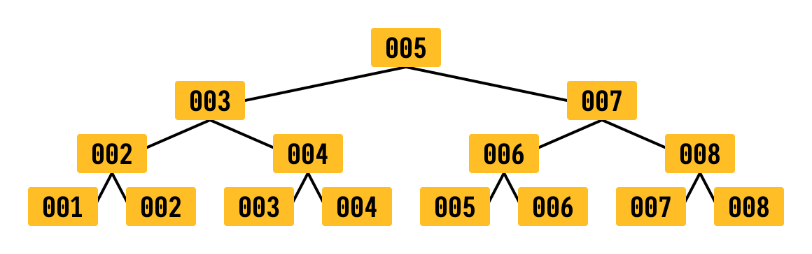

# B-Tree

Os índices são criados usando uma estrutura de dados chamada B-Tree (o sqlite usa B+ Tree). Ela faz com que a busca do usuário de id 1 ou 45323 tenha a mesma performance.

[USFCA](https://www.cs.usfca.edu/~galles/visualization/BPlusTree.html)

